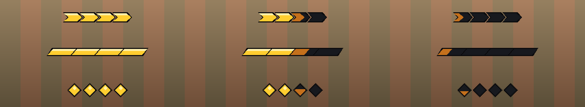
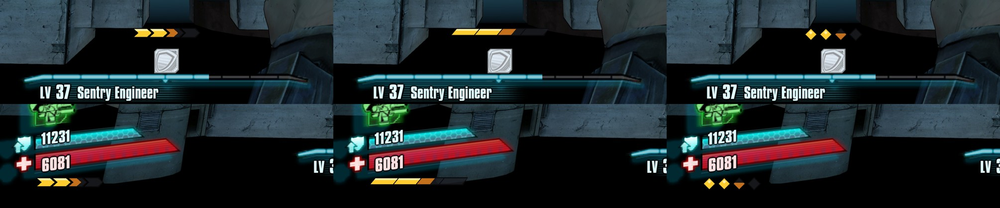

# Movement Overhaul for Borderlands 2

Fluid, modern movement for Borderlands 2: toggle sprint, slides you can steer and chain, a stamina dash, double jump, air control that keeps your momentum, and climbing over ledges. One mod, everything tunable in the Mods menu.


https://github.com/user-attachments/assets/9b60b51e-ef16-419f-841e-539a92ecff8a




## Features

- **Sprint** - tap to toggle, sprint in any direction, keep sprinting while shooting and aiming, no aiming slowdown.
- **Slide** - crouch while sprinting. Slides stay faster than a sprint until they end, follow your steering, and keep going downhill. Jump out of a slide to keep its speed, and chain slide-jump-slide.
- **Dash** - a stamina-charge dash on the ground and in the air. Dash momentum carries into a slide.
- **Air jumps and fast fall** - a double jump, and double-tap crouch in the air to slam down.
- **Air control** - steer in the air without losing the speed you jumped with.
- **Mantle** - hold jump into a ledge to climb over it.
- **Stamina bar** - three styles and three positions.
- **Sounds** - original sound effects for slides, dashes, air jumps and mantles, with their own volume controls. You can add your own.



## Requirements

- Borderlands 2 on PC (Steam or Epic).
- The [Willow2 Mod Manager (Python SDK)](https://github.com/bl-sdk/willow2-mod-manager/releases/latest) **v3.8 or newer**. Install it and start the game once before installing this mod.

## Install

**Option 1 - installer (recommended)**

1. Download this repo: the green **Code** button, then **Download ZIP** (or `git clone`), and unzip it.
2. Close Borderlands 2.
3. Double-click **`install.bat`**.

The installer finds your game (Steam, any Steam library, or Epic), checks the mod manager is installed, backs up any older version, and turns the mod on. It never overwrites your settings. If it can't find the game, it asks for the folder, or you can run `install.ps1 -GamePath "D:\Games\Borderlands 2"`.

**Option 2 - manual**

1. Download `movement_overhaul.sdkmod` from the [latest release](../../releases/latest).
2. Put it in `Borderlands 2\sdk_mods\`.
3. Start the game and turn **Movement Overhaul** on under **Mods**.

Either way: **Dash is on Left Shift** by default. Change it under *Mods > Movement Overhaul > Keybinds*.

Left Shift is also Borderlands 2's default Sprint key. With *Toggle sprint* on (the default) you start sprinting automatically and rarely need that key, but for the cleanest feel rebind Sprint in the game's own key bindings to something else.

## Update and uninstall

- **Update:** download the new version and run `install.bat` again. Your settings are kept.
- **Uninstall:** run `uninstall.bat`. Your settings file stays in `sdk_mods\settings` in case you come back.

## Things to know

- **Using juso's Sliding mod?** Turn it off - Movement Overhaul includes it, and running both doubles every slide.
- **Sounds** play through Windows rather than the game's audio engine, so the in-game volume sliders don't affect them. Use the volume sliders in the mod's Sounds options.
- **Your own sounds:** drop 16-bit PCM `.wav` files into `sdk_mods\movement_overhaul_sounds\<slide|dash|air_jump|mantle>\` and restart the game. They show up in the Sounds options, and updates never touch that folder.

## Known issues

- **Co-op is untested.** Everyone in the game needs the mod enabled, and slides are run by the host. Please report how it goes.
- **Controllers:** *Hold jump* mantling and *Slide on landing* read the keyboard directly, so they probably don't work on a gamepad. Set *Mantle* to *Automatic* if you play on a controller. Everything else uses the game's own inputs.
- Tested on the Steam version of Borderlands 2 with mod manager v3.8. The Epic version should work the same, but hasn't been tried.

## Reporting a bug

1. Turn on **Diagnostics** at the bottom of the mod's options.
2. Reproduce the problem.
3. Open an [issue](../../issues) with what you did and attach `Borderlands 2\Binaries\Win32\Plugins\unrealsdk.log`.

## Building from source

The mod is plain Python in `src/movement_overhaul`. To make the `.sdkmod` file:

```
python tools/build.py
```

It writes `dist/movement_overhaul.sdkmod`. The sound effects are generated from scratch by `tools/make_sounds.py`.

## Credits

- **Sliding by [juso](https://github.com/juso40).** The slide in this mod is juso's [Sliding](https://github.com/juso40/bl2sdk-mods/tree/main/sliding) mod, included with his [uemath](https://github.com/juso40/bl2sdk-mods/tree/main/uemath), [tweens](https://github.com/juso40/bl2sdk-mods/tree/main/tweens) and [coroutines](https://github.com/juso40/bl2sdk-mods/tree/main/coroutines) libraries under the MIT license. Sliding's movement code is unchanged, and the libraries only have small packaging fixes (for example tweens no longer pauses with the game, which could crash on quit). Movement Overhaul adds the speed and distance tuning, fast finish, slide chaining and dash momentum on top. Full license text in [LICENSE](LICENSE). Thanks juso!
- **[Willow2 Mod Manager](https://github.com/bl-sdk/willow2-mod-manager)** by the bl-sdk team, which this mod runs on.
- Everything else, including the sound effects, by dragonhoardinggold.

Borderlands 2 is a trademark of Gearbox Software. This is an unofficial fan mod, not affiliated with or endorsed by Gearbox or 2K.

## License

MIT - see [LICENSE](LICENSE).
